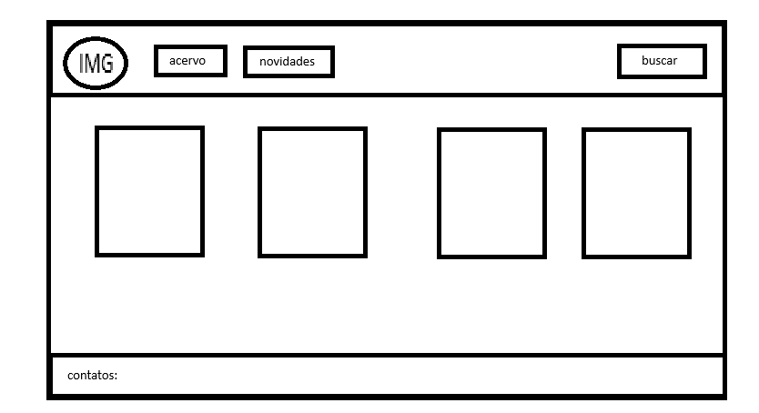
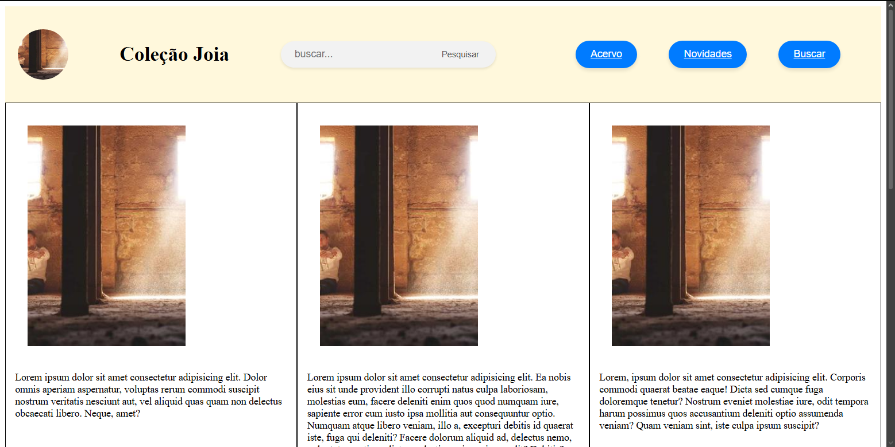

Gabriel Vinícius Soares Doti
matricula: 814583
4. Coleções e Itens	Coleção	Objeto / Item do acervo	Galeria e obras, álbuns e faixas, exposições e peças
Minha ideia é criar um site que exiba um acervo de obras ou coleções e que, no futuro, ofereça também a opção de compra.
